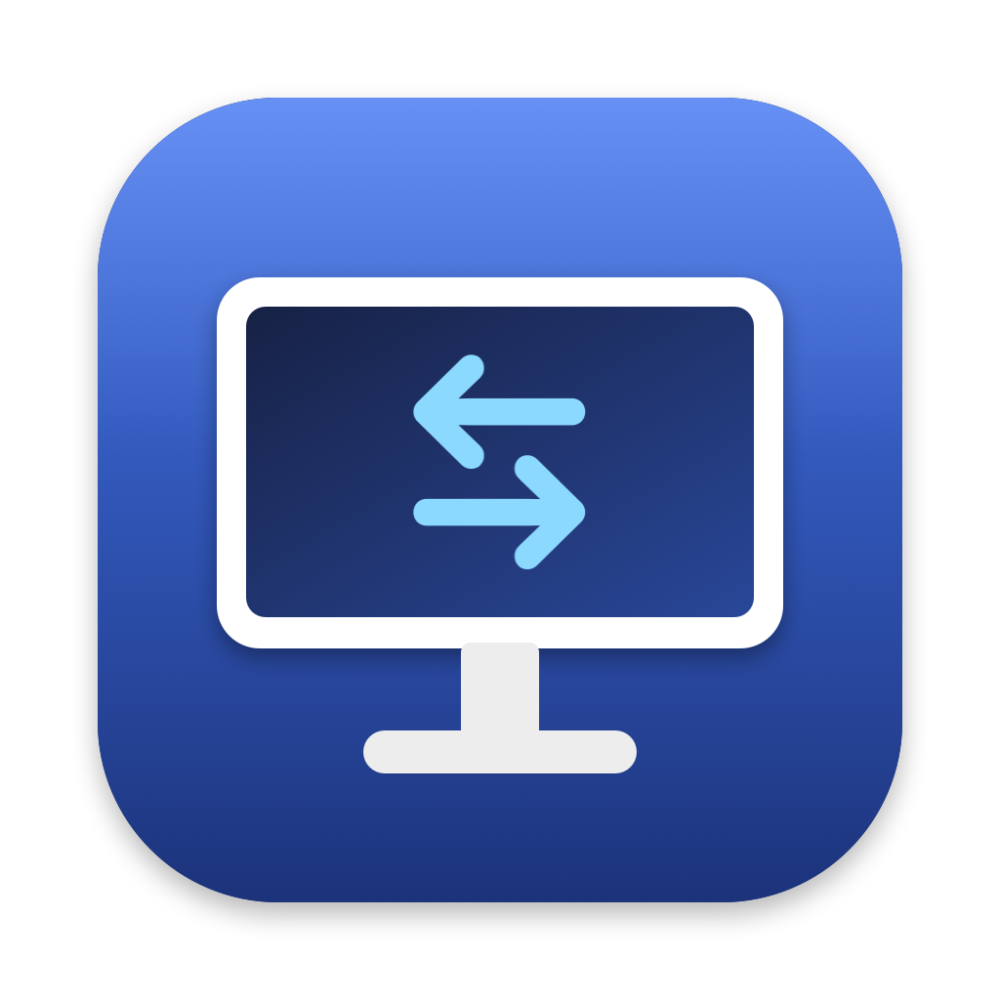
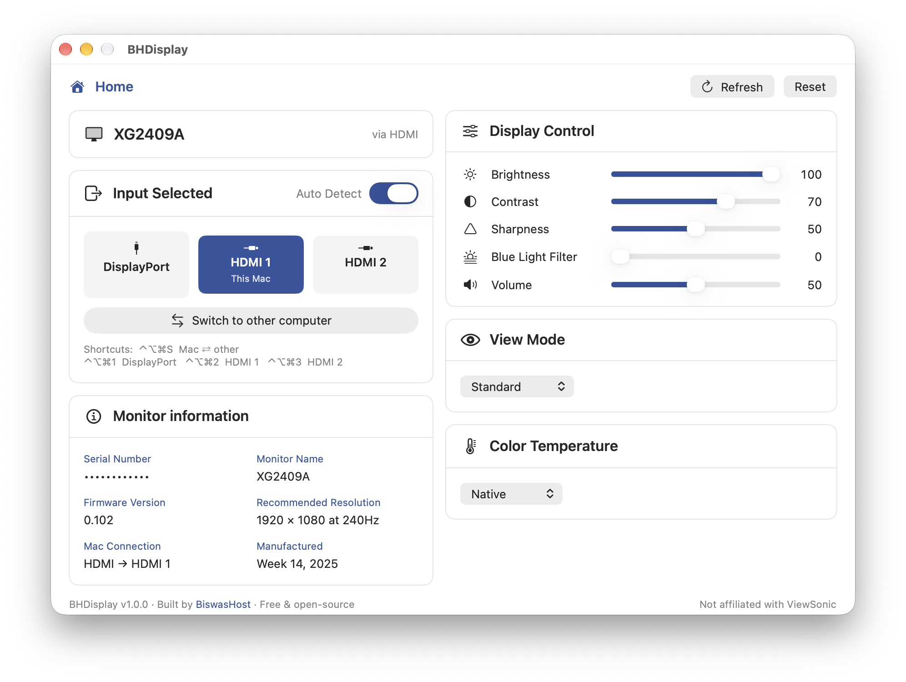
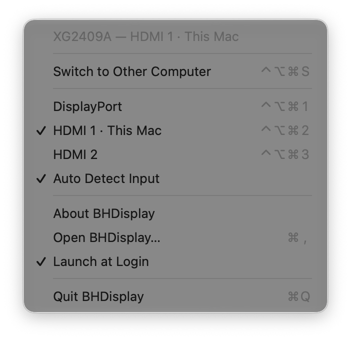

<p align="center"></p>

# BHDisplay — switch & control your ViewSonic monitor from the Mac menu bar

A native macOS menu-bar app by **BiswasHost** that switches your monitor between your Mac and
another computer in one click — and gives you brightness, contrast, sharpness, blue light filter,
volume, View Mode and colour temperature without touching the monitor's buttons. A free, working
alternative to ViewSonic's vDisplay Manager on modern macOS. 100% open-source.

**Available for:**

| Platform | Status |
|----------|--------|
| 🍎 **macOS** | ✅ **Stable** — native menu-bar app (Apple Silicon, macOS 14+) |

> 🟢 Runs the author's daily setup — one ViewSonic XG2409A shared between a MacBook Pro and a Windows PC.



---

## 💡 Why we built it

One monitor, two computers: a MacBook on HDMI and a Windows PC on DisplayPort. Switching between
them meant reaching behind the monitor for the joystick, opening the on-screen menu and stepping
through **Input Select** every single time.

ViewSonic's own **vDisplay Manager** should do this, but on current macOS it **crashes the moment
it starts** — inside its "AI presence sensor" module, before any window appears — and its
supported-model list doesn't even include gaming monitors like the XG series.

So BHDisplay talks to the monitor directly, using the same **DDC/CI** commands the monitor's own
menu uses. No drivers, no background services, no account — just a menu-bar icon.

## 🙌 How it helps you

- **Share one monitor between your Mac and a PC/console** — flip between them with
  **⌃⌥⌘S** from anywhere, even while the monitor is showing the other computer.
- **Stop digging through the monitor's menu** — brightness, contrast, blue light filter and
  volume are sliders on your screen.
- **Knows which port is your Mac** — plug the Mac into HDMI 1 or HDMI 2; BHDisplay works it out
  by itself and labels it *This Mac*.
- **Tells you why a switch "didn't work"** — if the other computer is asleep, the monitor's
  Auto Detect jumps back to the Mac. BHDisplay notices, explains it, and gives you the
  **Auto Detect** switch to keep the monitor where you put it.



## ✨ Features

- **One-click input switching** — DisplayPort · HDMI 1 · HDMI 2, from the window or the menu bar.
- **Global shortcuts** — **⌃⌥⌘S** Mac ⇄ other computer · **⌃⌥⌘1 / 2 / 3** DisplayPort / HDMI 1 / HDMI 2.
  (No Accessibility permission needed.)
- **Display Control** — brightness, contrast, sharpness, **blue light filter**, volume + mute.
- **View Mode** and **Color Temperature** presets (incl. User Color R/G/B gains).
- **Auto Detect on/off** — the monitor's own input auto-scan, from the app.
- **Monitor information** — model, serial, firmware, native resolution, which port the Mac uses.
- **Honest controls** — values are read back from the monitor, so a setting the monitor locked
  (e.g. Blue Light Filter in *FPS Game* mode) snaps back and says so instead of lying.
- **Menu-bar resident** — a Dock icon only while the settings window is open;
  **Launch at Login** from the menu.
- **Command line** — `BHDisplay --get`, `BHDisplay --input hdmi1`, handy for scripts and Shortcuts.

## 🖥️ Compatibility

- **Mac:** Apple Silicon (M1 or newer), macOS 14 Sonoma or later.
- **Monitor:** built and tested on the **ViewSonic XG2409A**. Brightness, contrast, volume and the
  other standard controls use standard DDC/CI codes and should work on most ViewSonic monitors.
  Input codes and View Mode names are model-specific — on other models a port may be labelled
  differently. Reports from other models are welcome in Issues.
- **Turn on DDC/CI** on the monitor: **Setup Menu ▸ DDC/CI ▸ On**.
- **Cable matters.** Use the Mac's **HDMI port** or a **USB-C to DisplayPort** cable. Many
  **USB-C to HDMI** adapters pass the picture but block DDC/CI — the app then shows
  *"Monitor refused DDC"* and can't switch anything. That is the adapter, not the app.

### 🛒 The exact setup we use — where to buy (Bangladesh)

Asked often, so here it is — the monitor and cable BHDisplay is built and tested with:

| What | Product | Buy |
|------|---------|-----|
| 🖥️ Monitor | **ViewSonic XG2409A** — 24″ FHD gaming monitor (DisplayPort + 2× HDMI) | [Ryans Computers](https://www.ryans.com/viewsonic-xg2409a-24-inch-fhd-display-gaming-monitor) |
| 🔌 Cable (Mac) | **ONTEN OTN-8318** — HDMI to HDMI, 1.5 m — MacBook's HDMI port → monitor | [Ryans Computers](https://www.ryans.com/onten-otn-8318-1.5-meter-black-cable) |

> The other computer (e.g. a Windows PC) goes into the monitor's **DisplayPort** with a normal
> DisplayPort cable. Not sponsored — just what we use.

## ⬇️ Download & Install

Grab the latest build from the [**Releases**](https://github.com/wpexpertinbd/BHDisplay/releases) page.

### 🍎 macOS

Download **`BHDisplay-x.y.z.pkg`** (installer) or **`.dmg`** (drag to Applications).

**⚠️ First launch — "unidentified developer" / "damaged" (read this):** BHDisplay is free and
open-source but **not notarized by Apple** (that needs a paid Apple Developer account), so
macOS shows a one-time warning the **first** time you open it. You only do this **once**:

- **`.pkg` (recommended):**
  1. Double-click **`BHDisplay-x.y.z.pkg`**. macOS says it can't verify the developer and offers
     **Move to Trash** — click **Done** instead (don't trash it).
  2. Open **System Settings → Privacy & Security**, scroll down to
     *"BHDisplay-x.y.z.pkg was blocked…"* → **Open Anyway** → confirm with Touch ID / password.
  3. The installer opens — click through it. BHDisplay then opens normally, with **no second
     warning** (apps installed by the `.pkg` aren't flagged).
- **`.dmg`:** drag **BHDisplay** to Applications and open it. macOS shows the same warning for the
  app itself → click **Done** → **System Settings → Privacy & Security** →
  *"BHDisplay was blocked…"* → **Open Anyway** → **Open**.

The "damaged"/"can't be checked" message is just the download-quarantine flag on an
un-notarized app — nothing is actually wrong.

## 🚀 Quick start

1. On the monitor: **Setup Menu ▸ DDC/CI ▸ On**.
2. Open **BHDisplay** — the window shows your monitor, with your Mac's port marked *This Mac*.
3. Click an input, or press **⌃⌥⌘S** to flip to the other computer and back.
4. Close the window — BHDisplay keeps running in the menu bar. Tick **Launch at Login** there.

> If a switch bounces straight back to the Mac, the other computer is asleep (no picture), and
> the monitor's Auto Detect returned to an input that has one. Wake that computer, or turn
> **Auto Detect** off in BHDisplay.

## 🔒 Security

- **No network access at all** — no telemetry, no update pings, no accounts.
- **No admin rights, no helper tools, no kernel extensions.** It runs as you and talks only to
  the monitor over the display cable.
- **Replies from the monitor are validated** (address, length and checksum) before use; saved
  preferences are checked against the monitor's real inputs, so a corrupt value can't crash the
  app or send a wrong command.
- **Factory reset** asks for confirmation, names the monitor, and is only enabled once the
  monitor has been identified through the same channel the command goes to.
- Raw diagnostic writes on the command line need an explicit `--unsafe`, and reset/power codes
  an additional `--really`.

See [SECURITY.md](SECURITY.md) to report a problem.

---

## 🛠️ Build from source

Needs Xcode (or the Command Line Tools) — no Xcode project, no dependencies.

```bash
./build.sh            # → build/BHDisplay.app
./build.sh --install  # build and install to /Applications
./make-dist.sh        # → dist/BHDisplay-<ver>.dmg + .pkg
```

```
Sources/DDC.swift          DDC/CI transport over the Apple Silicon display controller (DCP)
Sources/Bridge.h           C declarations of the private IOKit I²C functions
Sources/Model.swift        monitor state, coalesced writes, read-back checks, port learning
Sources/MonitorInfo.swift  what macOS knows about the display (EDID, link type, native mode)
Sources/UI.swift           SwiftUI window
Sources/App.swift          menu bar, hotkeys, login item, About, command line
packaging/                 installer pages, DMG read-me, pkg preinstall
```

## 📄 Licence

MIT. See [LICENSE](LICENSE). Not affiliated with ViewSonic — see [DISCLAIMER.md](DISCLAIMER.md).

---

— BiswasHost · <https://www.biswashost.com>

## ☕ Support

BHDisplay is free and open-source. If it saved you time, you can **buy me a coffee** — it
genuinely helps me keep building and maintaining free tools like this. 🙏

- **bKash/Nagad** (Personal · *Send Money*): **`01710378396`**

ধন্যবাদ! / Thank you!
