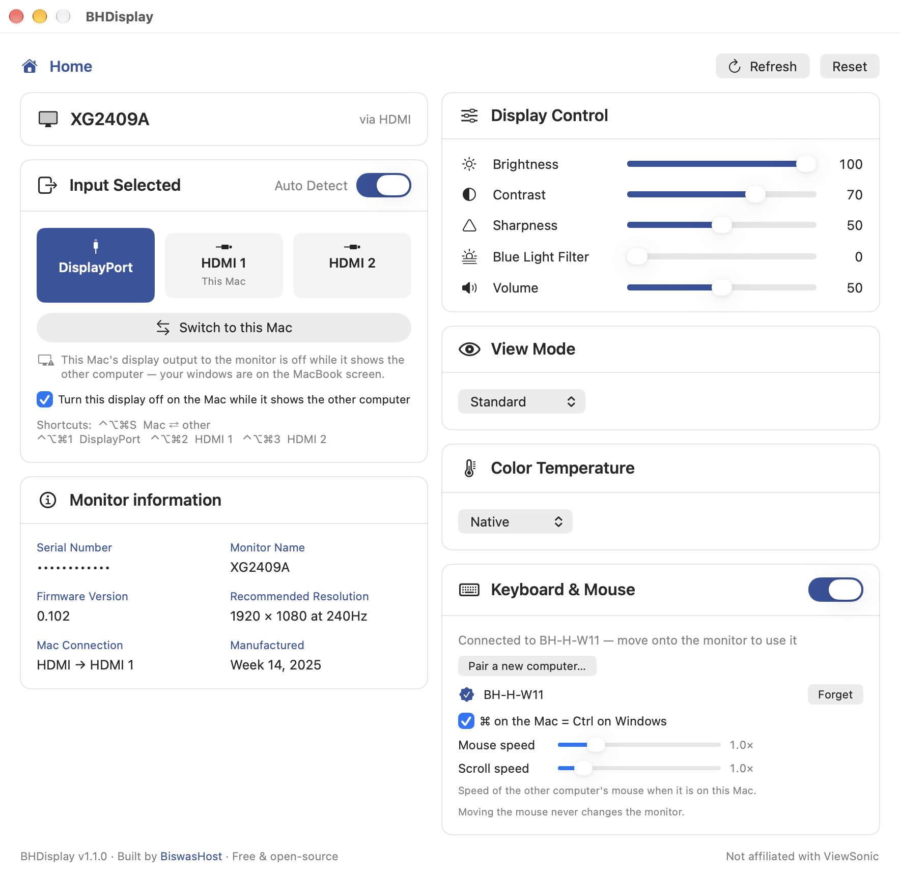
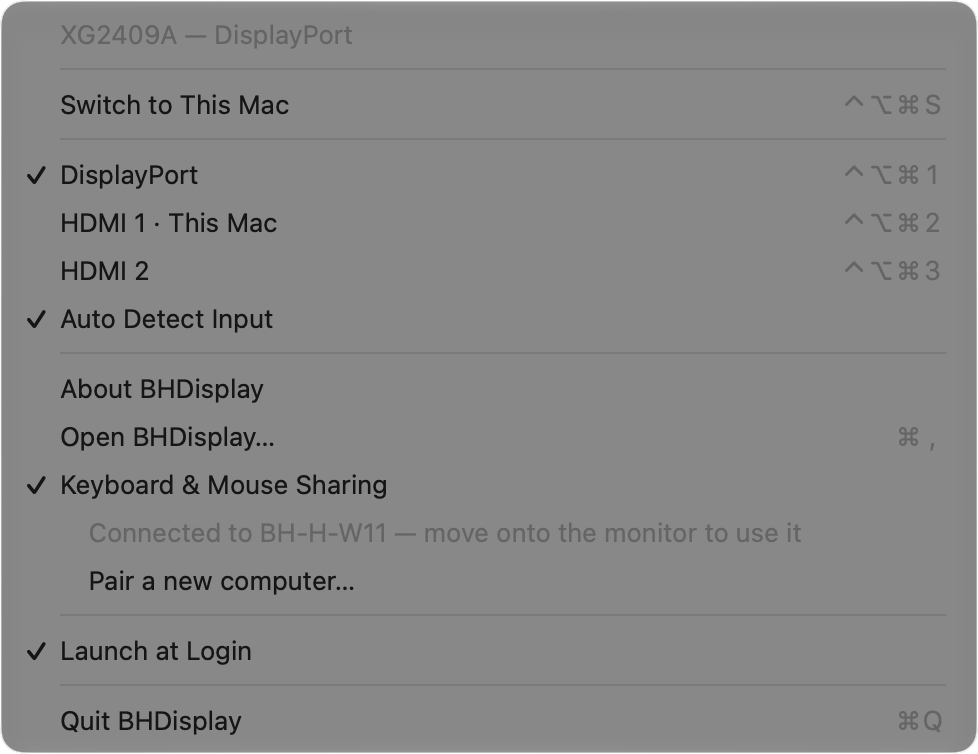

<p align="center"></p>

# BHDisplay — one monitor, two computers, one keyboard & mouse

Free, open-source apps by **BiswasHost** for a monitor shared between a Mac and a Windows PC:

- **Switch the monitor's input** in one click or one shortcut — from the Mac *or* the PC.
- **Control the monitor** from the Mac — brightness, contrast, sharpness, blue light filter,
  volume, View Mode and colour temperature — without touching its buttons.
- **Share keyboard & mouse both ways** — use the Mac's keyboard and trackpad on the PC, or the
  PC's keyboard and mouse on the Mac, with copy & paste of text between them. Encrypted, paired,
  local network only.

A working alternative to ViewSonic's vDisplay Manager on modern macOS, plus the keyboard & mouse
sharing it never had. 100% open-source.

**Available for:**

| Platform | Status |
|----------|--------|
| 🍎 **macOS** | ✅ **Stable** — native menu-bar app (Apple Silicon, macOS 14+) |
| 🪟 **Windows** | ✅ **Stable** — tray app with the same window, 0.2 MB (Windows 10 / 11) — input switching, monitor controls, keyboard & mouse sharing |

> 🟢 Runs the author's daily setup — one ViewSonic XG2409A shared between a MacBook Pro and a Windows PC.



---

## 💡 Why we built it

One monitor, two computers: a MacBook on HDMI and a Windows PC on DisplayPort. Switching between
them meant reaching behind the monitor for the joystick, opening the on-screen menu and stepping
through **Input Select** every single time.

ViewSonic's own **vDisplay Manager** should do this, but on current macOS it **crashes the moment
it starts** — inside its "AI presence sensor" module, before any window appears — and its
supported-model list doesn't even include gaming monitors like the XG series.

So BHDisplay talks to the monitor directly, using the same **DDC/CI** commands the monitor's own
menu uses. No drivers, no background services, no account — just a menu-bar icon.

## 🙌 How it helps you

- **Share one monitor between your Mac and a PC/console** — flip between them with
  **⌃⌥⌘S** from anywhere, even while the monitor is showing the other computer.
- **Stop digging through the monitor's menu** — brightness, contrast, blue light filter and
  volume are sliders on your screen.
- **Knows which port is your Mac** — plug the Mac into HDMI 1 or HDMI 2; BHDisplay works it out
  by itself and labels it *This Mac*.
- **Tells you why a switch "didn't work"** — if the other computer is asleep, the monitor's
  Auto Detect jumps back to the Mac. BHDisplay notices, explains it, and gives you the
  **Auto Detect** switch to keep the monitor where you put it.
- **One keyboard & mouse for both computers** — whichever keyboard and mouse is nearest your
  hand works on either computer: move the pointer across the screen edge and keep typing.
- **No phantom screens, on either computer** — while the monitor shows the PC, the Mac turns its output
  to it off, so the Mac behaves like a plain MacBook; while it shows the Mac, a PC with another screen does
  the same. Switching back turns it on first, so the monitor never sees an empty input.
- **Logs when you need them** — **Keep a Log** / **Check Log** in the menu of both apps.



## ✨ Features

- **One-click input switching** — DisplayPort · HDMI 1 · HDMI 2, from the window or the menu bar.
- **Global shortcuts** — **⌃⌥⌘S** Mac ⇄ other computer · **⌃⌥⌘1 / 2 / 3** DisplayPort / HDMI 1 / HDMI 2.
  (No Accessibility permission needed.)
- **Display Control** — brightness, contrast, sharpness, **blue light filter**, volume + mute.
- **View Mode** and **Color Temperature** presets (incl. User Color R/G/B gains).
- **Auto Detect on/off** — the monitor's own input auto-scan, from the app.
- **Monitor information** — model, serial, firmware, native resolution, which port the Mac uses.
- **Honest controls** — values are read back from the monitor, so a setting the monitor locked
  (e.g. Blue Light Filter in *FPS Game* mode) snaps back and says so instead of lying.
- **Menu-bar resident** — a Dock icon only while the settings window is open;
  **Launch at Login** from the menu.
- **Command line** — `BHDisplay --get`, `BHDisplay --input hdmi1`, handy for scripts and Shortcuts.

## ⌨️ Keyboard & mouse sharing (Mac ⇄ Windows)

Each keyboard and mouse works on **its own computer** and moves to the other only when you push
the pointer past the screen edge — whatever the monitor is showing. Moving the mouse **never**
switches the monitor; that stays a menu or shortcut action.

- **Monitor shows Windows:** the Mac's pointer moves from the MacBook screen onto the monitor →
  you're on Windows. Push the Windows mouse past the edge facing the MacBook → it's on the Mac.
- **Monitor shows the Mac:** push the Windows mouse past the far edge of the monitor → it controls
  the Mac. (The Mac's own pointer doesn't cross into Windows then — you couldn't see it.)
- **Both at once** — the mouse you moved last wins; neither side ever goes dead.
- **Copy & paste text** between the computers (password-manager items are never sent).
- **⌘ on the Mac = Ctrl on Windows** (optional), adjustable mouse and scroll speed, Caps Lock and
  key repeat carried across.
- **Take your keyboard back** any time: **⌃⌥⌘Esc** on the Mac, **Ctrl+Alt+Win+Esc** on Windows.
  Locking Windows or quitting either app also hands everything back.

**Pair once (about 30 seconds):**

1. Install BHDisplay on both computers (see *Download & Install*). On the Mac, open BHDisplay and
   turn on **Keyboard & Mouse** — macOS asks for the **Accessibility** permission, which sharing
   needs (it reads and types keys). On Windows it is on by default (tray icon).
2. On the PC: tray icon → **Pair a new computer…** — it now accepts a pairing for 2 minutes.
3. On the Mac: **Keyboard & Mouse** card → **Pair…** next to your PC.
4. Both screens show the **same 6-digit code**. Check they match, then click **Pair** on both.

From then on they reconnect by themselves. Nothing can pair without someone choosing
*Pair a new computer…* on that computer first.

| Shortcut | Mac | Windows |
|----------|-----|---------|
| Monitor: Mac ⇄ other computer | **⌃⌥⌘S** | **Ctrl+Alt+Win+S** |
| Monitor: DisplayPort / HDMI 1 / HDMI 2 | **⌃⌥⌘1 / 2 / 3** | **Ctrl+Alt+Win+1 / 2 / 3** |
| Take this computer's keyboard & mouse back | **⌃⌥⌘Esc** | **Ctrl+Alt+Win+Esc** |

## 🖥️ Compatibility

- **Mac:** Apple Silicon (M1 or newer), macOS 14 Sonoma or later.
- **Monitor:** built and tested on the **ViewSonic XG2409A**. Brightness, contrast, volume and the
  other standard controls use standard DDC/CI codes and should work on most ViewSonic monitors.
  Input codes and View Mode names are model-specific — on other models a port may be labelled
  differently. Reports from other models are welcome in Issues.
- **Turn on DDC/CI** on the monitor: **Setup Menu ▸ DDC/CI ▸ On**.
- **Cable matters.** Use the Mac's **HDMI port** or a **USB-C to DisplayPort** cable. Many
  **USB-C to HDMI** adapters pass the picture but block DDC/CI — the app then shows
  *"Monitor refused DDC"* and can't switch anything. That is the adapter, not the app.

### 🛒 The exact setup we use — where to buy (Bangladesh)

Asked often, so here it is — the monitor and cable BHDisplay is built and tested with:

| What | Product | Buy |
|------|---------|-----|
| 🖥️ Monitor | **ViewSonic XG2409A** — 24″ FHD gaming monitor (DisplayPort + 2× HDMI) | [Ryans Computers](https://www.ryans.com/viewsonic-xg2409a-24-inch-fhd-display-gaming-monitor) |
| 🔌 Cable (Mac) | **ONTEN OTN-8318** — HDMI to HDMI, 1.5 m — MacBook's HDMI port → monitor | [Ryans Computers](https://www.ryans.com/onten-otn-8318-1.5-meter-black-cable) |

> The other computer (e.g. a Windows PC) goes into the monitor's **DisplayPort** with a normal
> DisplayPort cable. Not sponsored — just what we use.

## ⬇️ Download & Install

Grab the latest build from the [**Releases**](https://github.com/wpexpertinbd/BHDisplay/releases) page.

### 🍎 macOS

Download **`BHDisplay-x.x.x.pkg`** (installer) or **`.dmg`** (drag to Applications).

**⚠️ First launch — "unidentified developer" / "damaged" (read this):** BHDisplay is free and
open-source but **not notarized by Apple** (that needs a paid Apple Developer account), so
macOS shows a one-time warning the **first** time you open it. You only do this **once**:

- **`.pkg` (recommended):**
  1. Double-click **`BHDisplay-x.x.x.pkg`**. macOS says it can't verify the developer and offers
     **Move to Trash** — click **Done** instead (don't trash it).
  2. Open **System Settings → Privacy & Security**, scroll down to
     *"BHDisplay-x.x.x.pkg was blocked…"* → **Open Anyway** → confirm with Touch ID / password.
  3. The installer opens — click through it. When it finishes, **BHDisplay starts by itself**
     (menu-bar icon), with **no second warning** — apps installed by the `.pkg` aren't flagged.
- **`.dmg`:** drag **BHDisplay** to Applications and open it. macOS shows the same warning for the
  app itself → click **Done** → **System Settings → Privacy & Security** →
  *"BHDisplay was blocked…"* → **Open Anyway** → **Open**.

The "damaged"/"can't be checked" message is just the download-quarantine flag on an
un-notarized app — nothing is actually wrong.

### 🪟 Windows (10 / 11)

Download **`BHDisplay-x.x.x-windows.exe`** (about 0.2 MB — it uses the .NET Framework that is
already part of Windows, so there is nothing else to install).

1. Double-click it. Windows SmartScreen may say *"Windows protected your PC"* (the app isn't
   code-signed — that needs a paid certificate): click **More info** → **Run anyway**.
2. It installs itself for your user (no admin password): into your Programs folder, with a
   **Start menu** entry, and it **starts with Windows**. You can delete the downloaded file.
3. BHDisplay lives in the **system tray** (click **^** next to the clock if you don't see it).
   **Click** the icon for the BHDisplay window — the same controls as on the Mac: inputs, brightness,
   contrast, sharpness, blue light filter, volume, View Mode, colour temperature, monitor information
   and keyboard & mouse sharing. **Right-click** for the quick menu.
   If Windows asks whether BHDisplay may use the network, allow **Private networks**.
4. **More than one monitor on the PC?** Pick a monitor at the top of the window to adjust *that* one
   (**Identify** shows which is which), and tick **"This is the monitor connected to the Mac"** on the one
   your Mac shares — the shortcuts and keyboard sharing always use that monitor.
   While that monitor shows the Mac, Windows **turns its output to it off** (and makes your other screen the main
   display), so apps never open on a screen you can't see. Switching back to the PC turns it on again first and
   gives the main display back — your arrangement returns exactly as it was.

**Update:** run the newer download — it replaces the installed copy and keeps your pairing.
**Remove:** **Settings ▸ Apps ▸ BHDisplay ▸ Uninstall**.
**Self-test:** `BHDisplay.exe --selftest` checks the encryption on that PC without changing anything.

## 🚀 Quick start

1. On the monitor: **Setup Menu ▸ DDC/CI ▸ On**.
2. Open **BHDisplay** — the window shows your monitor, with your Mac's port marked *This Mac*.
3. Click an input, or press **⌃⌥⌘S** to flip to the other computer and back.
4. Close the window — BHDisplay keeps running in the menu bar: **click** its icon to open the window again,
   **right-click** for the menu (tick **Launch at Login** there).
5. Optional: install BHDisplay on the PC and pair them (see *Keyboard & mouse sharing*) — then
   **Ctrl+Alt+Win+S** on the PC switches the monitor too, and either keyboard works on both.

> If a switch bounces straight back to the Mac, the other computer is asleep (no picture), and
> the monitor's Auto Detect returned to an input that has one. Wake that computer, or turn
> **Auto Detect** off in BHDisplay.

## 🔒 Security

- **No internet access** — no telemetry, no update pings, no accounts. Monitor control talks only
  to the monitor, over the display cable.
- **Keyboard & mouse sharing stays on your local network** and is off on the Mac until you turn
  it on. Every connection is **encrypted** (AES-256-GCM, fresh keys per session) and
  **authenticated** with each computer's own key; only a **paired** computer can type or click,
  and pairing needs a person to start it on that computer and confirm a 6-digit code on both
  screens (the code can't be forced to match by someone in between). The Mac never accepts or makes a
  sharing connection on its own addresses. Password-manager clipboard items are never sent.
- **No admin rights, no helper tools, no kernel extensions.** Sharing needs the Mac's
  Accessibility permission (to read and type keys); monitor control needs nothing.
- **Replies from the monitor are validated** (address, length and checksum) before use; saved
  preferences are checked against the monitor's real inputs, so a corrupt value can't crash the
  app or send a wrong command.
- **Factory reset** asks for confirmation, names the monitor, and is only enabled once the
  monitor has been identified through the same channel the command goes to.
- Raw diagnostic writes on the command line need an explicit `--unsafe`, and reset/power codes
  an additional `--really`.

See [SECURITY.md](SECURITY.md) to report a problem.

---

## 🛠️ Build from source

Needs Xcode (or the Command Line Tools) — no Xcode project, no dependencies.

```bash
./build.sh            # → build.noindex/BHDisplay.app
./build.sh --install  # build and install to /Applications
./make-dist.sh        # → dist/BHDisplay-<ver>.dmg + .pkg
```

The Windows app builds on the Mac too, with the .NET SDK — no Windows needed:

```bash
cd windows/BHDisplayWin && dotnet publish -c Release -o ../dist   # → windows/dist/BHDisplay.exe
```

Tests: `tests/sharecore` and `tests/sharenet` (Swift), `tests/gcm` (the Windows encryption against
NIST/RFC test vectors and .NET's own), and `tests/interop/run.sh` (Mac ⇄ Windows handshake and
messages, both directions).

```
Sources/DDC.swift          DDC/CI transport over the Apple Silicon display controller (DCP)
Sources/Bridge.h           C declarations of the private IOKit I²C functions
Sources/Model.swift        monitor state, coalesced writes, read-back checks, port learning
Sources/MonitorInfo.swift  what macOS knows about the display (EDID, link type, native mode)
Sources/UI.swift           SwiftUI window
Sources/App.swift          menu bar, hotkeys, login item, About, command line
Sources/Share*.swift       keyboard & mouse sharing: protocol, network, input capture/replay
Sources/DisplayPower.swift turns the Mac's output to the monitor off/on
docs/SHARING-PROTOCOL.md   the sharing protocol (both apps implement it)
windows/BHDisplayWin/      BHDisplay for Windows (C#, .NET Framework 4.8, WinForms tray app)
packaging/                 installer pages, DMG read-me, pkg preinstall
```

## 📄 Licence

MIT. See [LICENSE](LICENSE). Not affiliated with ViewSonic — see [DISCLAIMER.md](DISCLAIMER.md).

---

— BiswasHost · <https://www.biswashost.com>

## ☕ Support

BHDisplay is free and open-source. If it saved you time, you can **buy me a coffee** — it
genuinely helps me keep building and maintaining free tools like this. 🙏

- **bKash/Nagad** (Personal · *Send Money*): **`01710378396`**

ধন্যবাদ! / Thank you!
